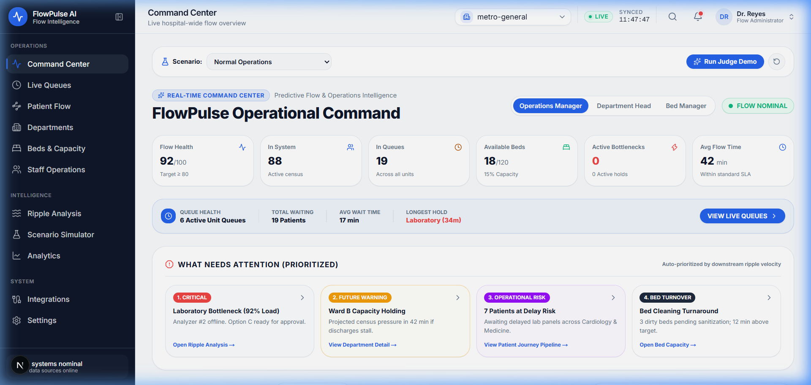
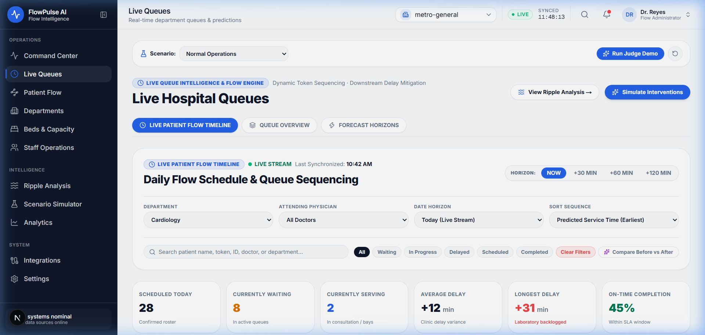
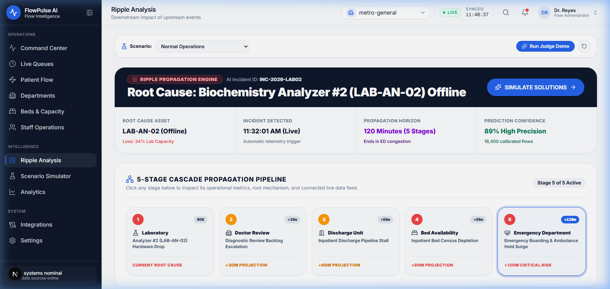
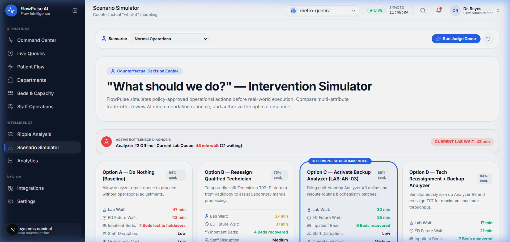
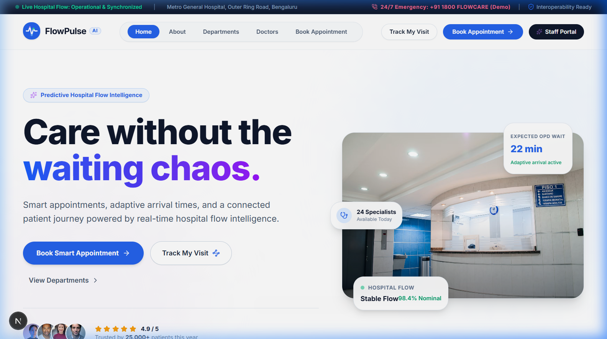
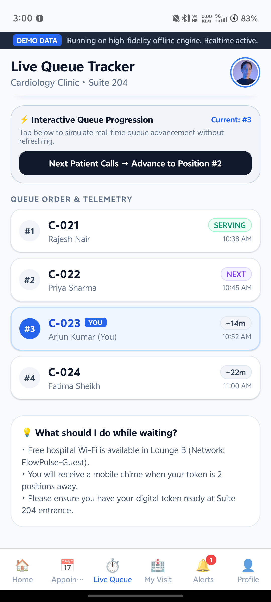
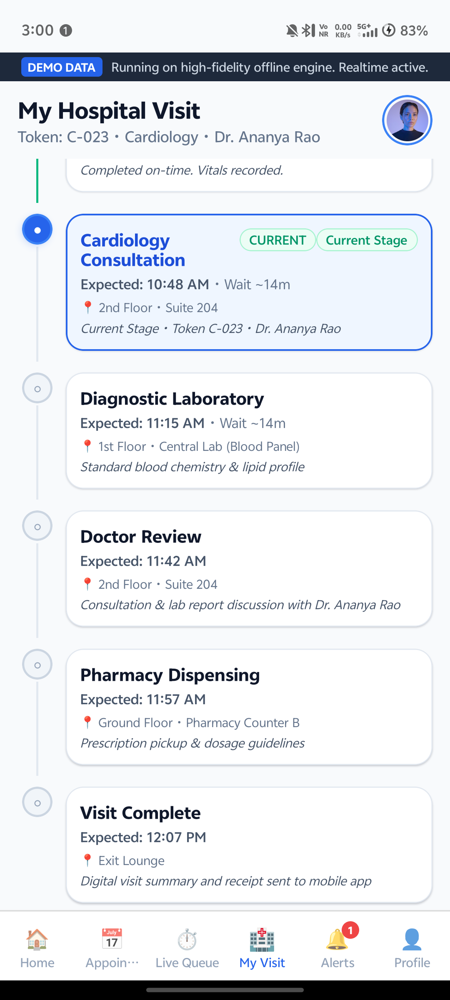

# FlowPulse AI

### Predictive Hospital Flow Intelligence & Counterfactual Operations Platform

> **"Don't manage the queue. Prevent the ripple."**

FlowPulse predicts patient waiting time and total visit completion, detects hospital queue bottlenecks, forecasts their downstream ripple effects, and allows hospital operations teams to simulate corrective actions before implementation.

---

[](https://github.com/Muthudeenathayalan/flowpulse/actions/workflows/ci.yml)
[](https://nextjs.org/)
[](https://react.dev/)
[](https://www.typescriptlang.org/)
[](https://reactnative.dev/)
[](https://expo.dev/)
[](https://supabase.com/)
[](https://tailwindcss.com/)

---

## 📸 Product Preview

### 1. Executive Operations Command Center (`/staff`)
*Interactive 10-department hospital care pathway graph, live census vitals, and operational incident dispatch.*


---

### 2. Live Smart Queue Intelligence & Daily Flow Timeline (`/staff/live-queues`)
*Dynamic token sequencing, active resource tracking, root-cause attribution, and chronological patient schedules with live NOW marker.*


---

### 3. Downstream Ripple Cascade Analysis (`/staff/ripple-analysis`)
*Visual attribution and directional graph forecasting how upstream lab delays cascade into Doctor Review holds, bed blocks, and ED congestion across 4 time horizons.*


---

### 4. Counterfactual Scenario Simulator (`/staff/scenario-simulator`)
*Sandbox for evaluating candidate recovery interventions with multi-attribute trade-offs, confidence scoring, and human-in-the-loop authorization.*


---

### 5. Patient Public Portal & Mobile Experience (`/` & `mobile/`)
*Adaptive arrival windows, personal door-to-door visit timeline, live queue token status, and synchronized disruption notifications.*

| Patient Landing Portal (`/`) | Mobile Live Queue | Mobile Care Pathway |
| :---: | :---: | :---: |
|  |  |  |

---

## 🏥 Why FlowPulse?

A modern hospital is not a collection of isolated queues — it is a tightly coupled operational flow network:

$$\text{Registration} \longrightarrow \text{Consultation} \longrightarrow \text{Diagnostics} \longrightarrow \text{Doctor Review} \longrightarrow \text{Pharmacy} \longrightarrow \text{Discharge}$$

When an upstream bottleneck occurs (such as a biochemistry analyzer going offline in the laboratory), the resulting delay propagates downstream: outpatient consultations stall waiting for essential panels, inpatient discharge orders cannot be finalized, beds cannot be turned over, and emergency department boarding escalates.

Traditional hospital management tools only display historical dashboards after waiting rooms have already overflowed. **FlowPulse focuses on reducing non-clinical operational waiting by predicting downstream queue propagation hours in advance and simulating counterfactual interventions before execution.**

> [!IMPORTANT]
> **Clinical Scope Disclaimer**: FlowPulse AI models non-clinical operational logistics (queueing, bed turnover, transit times, and equipment utilization). It **does not diagnose patients** and **does not determine clinical triage priority**. All medical decisions remain strictly with authorized healthcare professionals.

---

## 🔄 Input ➔ Intelligence ➔ Output

```
┌──────────────────────────────────────────────┐
│                    INPUT                     │
│  • Patient & Specialist Appointment Data     │
│  • Live Department Queue Telemetry           │
│  • Active Staffing & On-Duty Resources      │
│  • Diagnostic Equipment Operational Status   │
│  • Inpatient Bed Turnover & Discharge Holds  │
└──────────────────────┬───────────────────────┘
                       │
                       ▼
┌──────────────────────────────────────────────┐
│              FLOWPULSE ENGINE                │
│  • Queue Wait-Time Estimation Formulation    │
│  • Adaptive Arrival Window Calculator        │
│  • 6-Stage Door-to-Door Journey Transit      │
│  • Cross-Department Ripple Cascade Forecaster│
│  • Counterfactual Intervention Simulator     │
└──────────────────────┬───────────────────────┘
                       │
                       ▼
┌──────────────────────────────────────────────┐
│                    OUTPUT                    │
│  • Live Queue Position & Patients Ahead      │
│  • Dynamic Recommended Arrival Target        │
│  • Predicted Consultation & Exit Times       │
│  • 4-Horizon Bottleneck Escalation Alerts    │
│  • Evaluated Intervention Recommendations    │
└──────────────────────────────────────────────┘
```

---

## 💡 What Makes FlowPulse Different?

> **"FlowPulse does not only ask where the queue is. It asks where the delay started, where it will spread, how it will affect individual patients, and which intervention offers the best operational outcome."**

| Capability | Legacy Hospital Dashboards | FlowPulse AI Platform |
| :--- | :--- | :--- |
| **Queue Visibility** | Static historical counts per department | Live token progression with active resource scaling |
| **Patient Arrival** | Generic fixed offset ("arrive 30m early") | **Adaptive arrival windows** dynamically calculated from clinic backlog |
| **Visit Duration** | Single department estimation | **Door-to-door 6-stage transit completion** forecast |
| **Delay Propagation** | None (siloed departmental views) | **Cross-department ripple cascade forecasting** across 30m, 60m, 120m horizons |
| **Action Strategy** | Trial-and-error reactive responses | **Counterfactual simulation** comparing time, cost, bed, and staff impact |
| **Governance** | Unassisted manual workflows | **Human-in-the-loop authorization** before triggering recovery dynamics |
| **Patient Sync** | Disconnected waiting room screens | **Synchronized mobile app** updating patients in real time |

---

## 📖 Real Operational Narrative: Arjun Kumar's Visit

To understand FlowPulse in action, consider how a diagnostic equipment failure propagates through the hospital:

```
 10:30 AM                    10:45 AM                     11:00 AM                    11:05 AM
┌────────────────────────┐  ┌────────────────────────┐  ┌────────────────────────┐  ┌────────────────────────┐
│  1. NOMINAL BASELINE   │  │  2. UPSTREAM INCIDENT  │  │  3. RIPPLE PROPAGATES  │  │  4. RECOVERY APPROVED  │
│                        │  │                        │  │                        │  │                        │
│ • Arjun Kumar arrives  │  │ • Analyzer LAB-AN-02   │  │ • Lab wait surges      │  │ • Staff approves       │
│   for Cardiology OPD   │  │   goes offline         │  │   18m ➔ 43m            │  │   Option C (Backup     │
│ • Queue Position: #3   │  │ • FlowPulse detects    │  │ • Arjun's completion   │  │   Analyzer + Runner)   │
│ • Estimated Wait: 14m  │  │   diagnostic choke     │  │   shifts to 12:16 PM   │  │ • Lab wait ➔ 20m       │
│ • Expected Exit:       │  │ • Mobile receives      │  │ • Downstream bed holds │  │ • Arjun's completion   │
│   12:00 PM             │  │   proactive alert      │  │   and ED boarding rise │  │   recovers to 12:07 PM │
└────────────────────────┘  └────────────────────────┘  └────────────────────────┘  └────────────────────────┘
```

1. **Nominal Baseline**: Arjun Kumar is scheduled for a Cardiology consultation at 10:30 AM. FlowPulse calculates an expected door-to-door visit completion of **12:00 PM**.
2. **Upstream Disruption**: Biochemistry analyzer `LAB-AN-02` experiences an outage. Laboratory queue turnaround surges from **18 min to 43 min**.
3. **Ripple Propagation**: FlowPulse forecasts that the lab delay will stall Doctor Reviews (+14 projected holds), delay inpatient discharges (+9 holds), and cascade into Emergency Department boarding (+25 min). Arjun's expected hospital exit shifts from **12:00 PM to 12:16 PM**.
4. **Counterfactual Simulation & Recovery**: Hospital operations staff open the **Scenario Simulator**. The engine evaluates 4 options and recommends **Option C: Activate Backup Analyzer LAB-AN-03 & Dedicated Runner** (*88% confidence*). Staff authorizes Option C. Laboratory wait drops to **20 min**, and Arjun's expected exit recovers to **12:07 PM (9 minutes saved)**.

---

## 🖥️ Platform Modules

### 🏥 Staff Operations Command Center (`flowpulse_work/`)
- **Target Roles**: Operations Directors, Department Heads, Bed Managers, Triage Coordinators.
- **Features**:
  - Executive Command Center with React Flow Care Pathway
  - Live Department Queue Heatmaps & Token Status
  - Live Patient Flow Timeline with Scheduled vs Predicted Times
  - Downstream Ripple Cascade Graph & Attribution
  - Counterfactual Scenario Simulator with Human-in-the-Loop Approval
  - 120-Bed Interactive Ward Capacity Grid
  - Staff Workforce Directory & Reassignment Sandbox
  - Recharts Operational Telemetry & Model Analytics

### 📱 Patient Mobile Application (`mobile/`)
- **Target Users**: Outpatient visitors and scheduled care patients.
- **Features**:
  - 5-Step Smart Appointment Booking Wizard
  - Adaptive Arrival Window Targeting
  - Live Queue Token Position & Waiting Count
  - Door-to-Door Vertical Journey Pathway
  - Real-Time Disruption & Recovery Push Notifications
  - Offline Scenario Controller for Hackathon Demonstrations

---

## 🏗️ Repository Layout

```
flowpulse/
├── .github/
│   └── workflows/
│       └── ci.yml                 # GitHub Actions CI (Typecheck & Build)
│
├── flowpulse_work/                # Staff Command Center & Web Portal
│   ├── app/                       # Next.js App Router (19 static pages)
│   ├── components/                # Modular UI, charts, flow graphs & drawers
│   ├── lib/
│   │   ├── engine/                # Pure TypeScript Queue & Journey Engines
│   │   ├── state/                 # Scenario Simulator & State Reducers
│   │   └── data/                  # Domain Types, Hospital Models & Benchmarks
│   ├── package.json               # Next.js 16, React 19, Tailwind v4
│   └── tsconfig.json              # Strict TypeScript configuration
│
├── mobile/                        # Patient Mobile Application
│   ├── app/                       # Expo Router v4 screens (Tabs & Booking)
│   ├── components/                # Mobile cards, timelines, token banners
│   ├── hooks/                     # Supabase Realtime & Journey hooks
│   ├── lib/                       # Mobile Queue Engines & Supabase client
│   ├── package.json               # Expo ~52.0, React Native 0.76
│   └── tsconfig.json              # Strict TypeScript configuration
│
├── docs/
│   ├── images/                    # Authentic product preview screenshots
│   ├── ARCHITECTURE.md            # Comprehensive system architecture & diagrams
│   └── ALGORITHMS.md              # Mathematical formulations & queue models
│
├── scripts/
│   └── android/                   # Android build & phone deployment scripts
│
├── profile/
│   └── README.md                  # Professional developer profile README
│
├── CONTRIBUTING.md                # Contributor & Conventional Commit guide
├── SECURITY.md                    # Healthcare privacy & vulnerability policy
├── CHANGELOG.md                   # Version release notes (v0.1.0)
└── README.md                      # Project documentation
```

---

## ⚡ Quick Start Guide

### 1. Web Application (Staff Command Center & Patient Portal)
```bash
# Clone the repository
git clone https://github.com/Muthudeenathayalan/flowpulse.git
cd flowpulse/flowpulse_work

# Install dependencies
npm install

# Start development server
npm run dev

# Open in browser: http://localhost:3000
```

### 2. Patient Mobile Application (Expo & React Native)
```bash
cd flowpulse/mobile

# Install dependencies
npm install

# Start Expo development server
npx expo start
```
*Press **`a`** to launch in connected Android device/emulator, or scan the QR code with **Expo Go**.*

### 3. Native Android Build & Deploy
```bash
# Compile and install APK to USB-connected Android phone:
scripts\android\BUILD_AND_INSTALL_EVERYTHING.bat
```

---

## 🔐 Environment Configuration

Both web and mobile applications include `.env.example` templates:

### Web (`flowpulse_work/.env.example`):
```ini
NEXT_PUBLIC_SUPABASE_URL=https://your-project.supabase.co
NEXT_PUBLIC_SUPABASE_ANON_KEY=your-anon-key-here
```

### Mobile (`mobile/.env.example`):
```ini
EXPO_PUBLIC_SUPABASE_URL=https://your-project.supabase.co
EXPO_PUBLIC_SUPABASE_ANON_KEY=your-anon-key-here
```

> **Note**: If Supabase credentials are not provided, both applications automatically run in **High-Fidelity Offline Demo Mode**, ensuring full functionality without external database dependencies.

---

## 📚 Technical Documentation

- 🏛️ [System Architecture & Data Topology](docs/ARCHITECTURE.md)
- 📐 [Mathematical Models & Algorithmic Formulations](docs/ALGORITHMS.md)
- 🤝 [Contribution Guidelines](CONTRIBUTING.md)
- 🛡️ [Security & Privacy Policy](SECURITY.md)
- 📋 [Version Changelog](CHANGELOG.md)

---

## 👥 Authors & Acknowledgments

Developed by **Muthudeenathayalan V** ([@Muthudeenathayalan](https://github.com/Muthudeenathayalan)).
