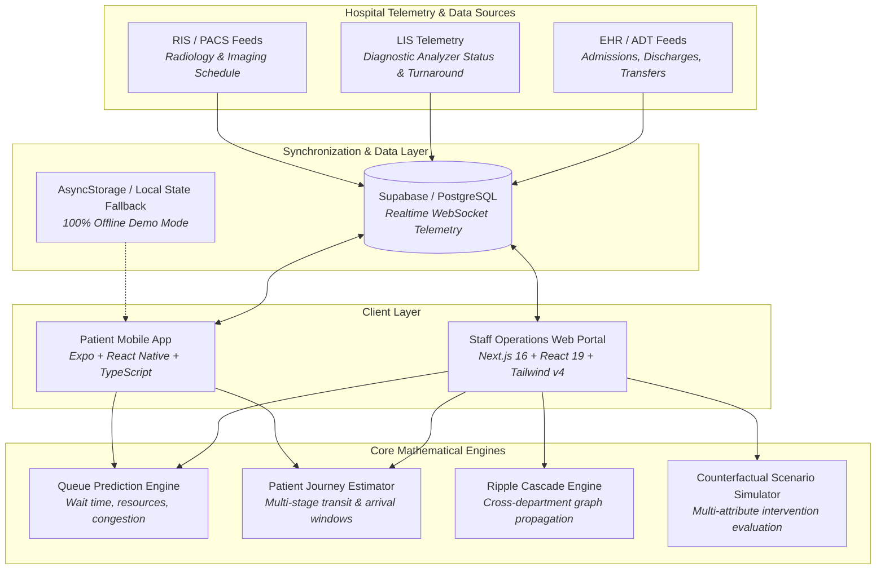
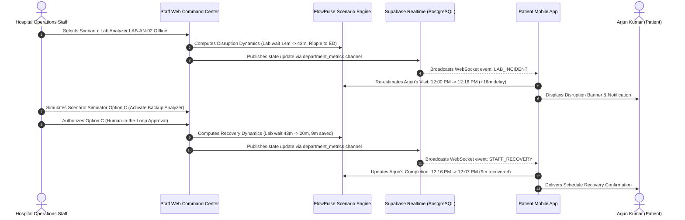

# FlowPulse AI — System Architecture

This document details the architectural design, component layers, state lifecycle, and data synchronization topology of the **FlowPulse AI** platform.

---

## 1. High-Level Architectural Topology

FlowPulse AI is structured into two decoupled presentation applications (an enterprise Operations Command Center web application and a lightweight Patient Mobile application) that share mathematical calculation engines and synchronize in real time through PostgreSQL / Supabase event streams.

---

## 2. Component Layer Breakdown

### A. Staff Operations Web Portal (`flowpulse_work/`)
Built with **Next.js 16 (Turbopack)**, **React 19**, and **Tailwind CSS v4**. It serves hospital administrators, operations directors, bed managers, and department supervisors:
- **Executive Command Center (`/staff`)**: Real-time hospital overview featuring an interactive React Flow department dependency graph, live census vitals, and operational alerts.
- **Live Smart Queues (`/staff/live-queues`)**: Active department queue heatmaps, token queues, and 4-horizon predictive forecasting (`NOW`, `+30m`, `+60m`, `+120m`).
- **Live Patient Flow Timeline (`/staff/live-queues?tab=timeline` & `/staff/patient-flow`)**: Chronological daily schedule with Scheduled vs Predicted service times, dynamic NOW marker, and individual 6-stage patient care pathway drawers.
- **Ripple Cascade Analysis (`/staff/ripple-analysis`)**: Visual attribution and cascade graph modeling how an upstream disruption (e.g. laboratory analyzer outage) propagates to Doctor Review, Inpatient Beds, and Emergency Department boarding.
- **Counterfactual Scenario Simulator (`/staff/scenario-simulator`)**: Sandbox allowing operations staff to model candidate interventions (reassign staff, activate backup analyzers, divert non-urgent samples), compare multi-dimensional trade-offs, and authorize recovery with human-in-the-loop governance.
- **Beds Capacity Matrix (`/staff/beds-capacity`)**: 120-bed interactive ward grid tracking occupancy, turnaround, and discharge hold states.
- **Staff Operations & Analytics (`/staff/staff-operations`, `/staff/analytics`)**: Workload telemetry, technician reassignment models, and Recharts performance analytics.

### B. Patient Mobile Application (`mobile/`)
Built with **Expo (~52.0)**, **React Native (0.76)**, **Expo Router v4**, and **TypeScript**. It serves outpatient and scheduled care patients:
- **Smart Appointment Booking**: 5-step booking flow calculating adaptive arrival windows based on real-time clinic throughput.
- **Live Queue Position Tracker**: High-visibility token display showing current position (`#3`), patients ahead (`2`), estimated wait (`14m`), and estimated consultation time.
- **Door-to-Door Journey Pathway**: 6-stage milestone tracker (Registration → Consultation → Diagnostics → Review → Pharmacy → Exit) synchronized dynamically with hospital incidents and recoveries.
- **Proactive Disruption Notifications**: Real-time push-style notifications when hospital delays occur or when interventions successfully recover time.
- **Judge & Demo Switcher**: Embedded profile switcher to toggle scenarios (`Normal Baseline`, `Lab Outage`, `Staff Recovery`) for live offline demonstrations.

### C. Shared Mathematical Calculation Engines
Located in `flowpulse_work/lib/engine/` and mirrored in `mobile/lib/engines/`:
- `queue-engine.ts`: Pure TypeScript calculation functions for queue wait estimation, arrival window targeting, and stage delay propagation.
- `scenario-engine.ts`: Dynamic scenario state transitions, ripple step evaluation, and multi-attribute intervention scoring.
- `selectors.ts`: Memoized state selectors computing KPIs, bottleneck risk scores, and department health metrics without side effects.

---

## 3. State Management & Realtime Synchronization

---

## 4. Key Design Principles

1. **Strict Decoupling**: The web application and mobile application are completely standalone packages. Either can be developed, tested, and built independently without dependency leaks.
2. **Deterministic Mathematical Engines**: All wait-time algorithms and journey estimations are implemented as pure TypeScript functions, ensuring testability and reproducible outputs.
3. **Graceful Offline Degradation**: When Supabase backend credentials are not provided, both applications seamlessly transition into a high-fidelity synthetic demo mode.
4. **Human-in-the-Loop Governance**: FlowPulse AI never autonomously enacts operational interventions or alters clinical protocols. It presents predictive models and counterfactual recommendations to authorized hospital managers for review and approval.
5. **Non-Clinical Boundary**: FlowPulse AI focuses exclusively on non-clinical operational logistics (queueing, bed turnover, equipment utilization, transit times). Clinical diagnosis, triage, and patient prioritization remain strictly with licensed healthcare providers.
